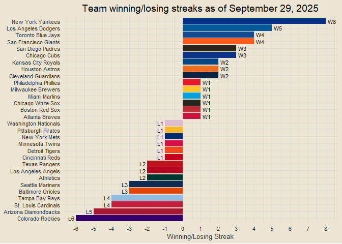
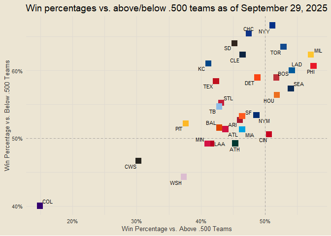
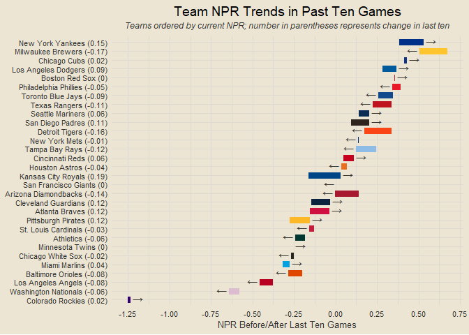
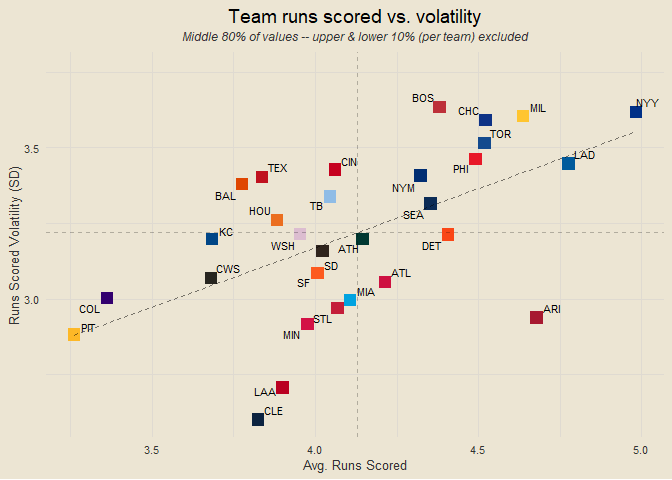

Chad’s 2025 MLB Report
================

*Interested in the underlying code that builds this report?* Check it
out on GitHub:
<a href="https://github.com/chadallison/mlb25" target="_blank">mlb25</a>

------------------------------------------------------------------------

### Contents

- [Team Standings](#team-standings)
- [Runs Scored and Allowed per Game](#runs-scored-and-allowed-per-game)
- [NPR](#npr)
- [Offensive and Defensive NPR](#offensive-and-defensive-npr)
- [Run Differentials](#run-differentials)
- [Pythagorean Wins](#pythagorean-wins)
- [Actual vs Pythagorean Win
  Percentages](#actual-vs-pythagorean-win-percentages)
- [Winning and Losing Streaks](#winning-and-losing-streaks)
- [Home and Away Splits](#home-and-away-splits)
- [Rolling Window Pythagorean Wins](#rolling-window-pythagorean-wins)
- [Rolling Window NPR](#rolling-window-npr)
- [Records Against Teams with Winning vs Losing
  Records](#records-against-teams-with-winning-vs-losing-records)
- [Performance Against Teams with Winning
  Record](#performance-against-teams-with-winning-record)
- [NPR Trends](#npr-trends)

------------------------------------------------------------------------

### Team Standings

<!-- -->

------------------------------------------------------------------------

### Runs Scored and Allowed per Game

<!-- -->

------------------------------------------------------------------------

### NPR

<!-- -->

**What is NPR?**

NPR, Naive Performance Rating, is a metric I devised as a measure of
team performance above/below expected. The logic behind it is this: I
calculate each team’s expected runs scored in each game by taking the
average of their runs scored per game and their opponent’s runs allowed
per game. I then compare this expected value to the actual value of runs
scored or allowed to calculate each team’s offensive and defensive NPR
for each game. Here is an example.

Suppose the Cubs are playing the Cardinals. Let’s say the Cubs, on
average, score 4.5 runs per game and allow 3.25 runs per game. And let’s
say the Cardinals score 3.75 runs per game and allow 2.75 runs per game.
We calculate the Cubs’ expected run value as the average of their runs
scored per game and the Cardinals’ runs allowed per game, so (4.5 +
2.75) / 2 = 3.63. We would calculate the Cardinals’ expected run value
the same way, so (3.75 + 3.25) / 2 = 3.5. We now have the Cubs’ expected
run value as 3.63 and the Cardinals’ expected run value as 3.5.

Suppose that the final score of the game is a Cubs victory, 5-3. We
would calculate the Cubs’ offensive NPR as their actual score minus
their expected score: 5 - 3.63 = 1.37. We would calculate their
defensive NPR as the Cardinals’ expected score minus their actual score:
3.5 - 3 = 0.5 (we do it in this order so positive values are good). For
the Cardinals, their offensive NPR is their actual score minus their
expected score, 3 - 3.5 = -0.5, and their defensive NPR is the Cubs’
expected score minus their actual score, 3.63 - 5 = -1.37. Notice how
these numbers are opposite each other. So each team will have an
offensive and defensive NPR for each game, which are aggregated in the
plot above.

Of course, there are so many other factors that would play into a team’s
true expected value, such as any injuries, starting pitchers, weather,
and more. That is why I have named it Naive Performance Rating, because
it assumes matchup metrics are independent of each other and does not
take external factors into account. Which, of course, will lead to flaws
in the metric, but is done for the sake of simplicity and
interpretability.

------------------------------------------------------------------------

### Offensive and Defensive NPR

<!-- -->

------------------------------------------------------------------------

### Run Differentials

<!-- -->

------------------------------------------------------------------------

### Pythagorean Wins

<!-- -->

------------------------------------------------------------------------

### Actual vs Pythagorean Win Percentages

<!-- -->

------------------------------------------------------------------------

### Winning and Losing Streaks

<!-- -->

------------------------------------------------------------------------

### More to come as the season goes on!

------------------------------------------------------------------------

### Home and Away Splits

<!-- -->

------------------------------------------------------------------------

### Rolling Window Pythagorean Wins

<!-- -->

------------------------------------------------------------------------

### Rolling Window NPR

<!-- -->

------------------------------------------------------------------------

### Records Against Teams with Winning vs Losing Records

<!-- -->

------------------------------------------------------------------------

### Performance Against Teams with Winning Record

<!-- -->

------------------------------------------------------------------------

### NPR Trends

<!-- -->

------------------------------------------------------------------------

``` r
team_runs_scored_by_game = end_games |>
  select(date, team = home_team, runs = home_score) |>
  rbind(end_games |>
  select(date, team = away_team, runs = away_score)) |>
  arrange(team, date)

team_runs_avg_sd = team_runs_scored_by_game |>
  group_by(team) |>
  summarise(avg = mean(runs, trim = 0.1),
            sd = sd(runs)) |>
  mutate(lb = avg - sd,
         ub = avg + sd,
         range = ub - lb)

team_runs_avg_sd |>
  inner_join(teams_info, by = "team") |>
  ggplot(aes(avg, sd)) +
  geom_point(aes(col = team), shape = "square", size = 4, show.legend = F) +
  geom_line(stat = "smooth", method = "lm", formula = y ~ x, linetype = "dashed", alpha = 0.5) +
  geom_vline(xintercept = mean(team_runs_avg_sd$avg), linetype = "dashed", alpha = 0.25) +
  geom_hline(yintercept = mean(team_runs_avg_sd$sd), linetype = "dashed", alpha = 0.25) +
  ggrepel::geom_text_repel(aes(label = abb), size = 3, max.overlaps = 32) +
  scale_color_manual(values = team_hex) +
  scale_x_continuous(breaks = seq(0, 10, by = 0.5)) +
  scale_y_continuous(breaks = seq(0, 10, by = 0.5)) +
  labs(x = "Avg. Runs Scored", y = "Runs Scored Volatility (SD)",
       title = "Team runs scored vs. volatility",
       subtitle = "Middle 80% of values -- upper & lower 10% (per team) excluded")
```

<!-- -->

<!-- -->

<!-- -->

``` r
margin_limit = 10

home_sa = end_games |>
  filter(win_score - lose_score <= margin_limit) |>
  select(date, team = home_team, scored = home_score, allowed = away_score)

away_sa = end_games |>
  filter(win_score - lose_score <= margin_limit) |>
  select(date, team = away_team, scored = away_score, allowed = home_score)

team_adj_pythag = bind_rows(home_sa, away_sa) |>
  group_by(team) |>
  summarise(scored = sum(scored),
            allowed = sum(allowed)) |>
  transmute(team, adj_pythag = round(scored ** 1.83 / (scored ** 1.83 + allowed ** 1.83), 3))

team_pythag_small |>
  inner_join(team_adj_pythag, by = "team") |>
  mutate(raw_benefit = round(pythag - adj_pythag, 3)) |>
  arrange(desc(raw_benefit))
```

    ## # A tibble: 30 × 4
    ##    team              pythag adj_pythag raw_benefit
    ##    <chr>              <dbl>      <dbl>       <dbl>
    ##  1 Cincinnati Reds    0.543      0.46        0.083
    ##  2 Seattle Mariners   0.526      0.462       0.064
    ##  3 Chicago Cubs       0.608      0.548       0.06 
    ##  4 San Diego Padres   0.632      0.582       0.05 
    ##  5 Milwaukee Brewers  0.5        0.452       0.048
    ##  6 Tampa Bay Rays     0.475      0.431       0.044
    ##  7 Detroit Tigers     0.689      0.649       0.04 
    ##  8 Houston Astros     0.563      0.533       0.03 
    ##  9 New York Yankees   0.692      0.663       0.029
    ## 10 New York Mets      0.668      0.643       0.025
    ## # ℹ 20 more rows
